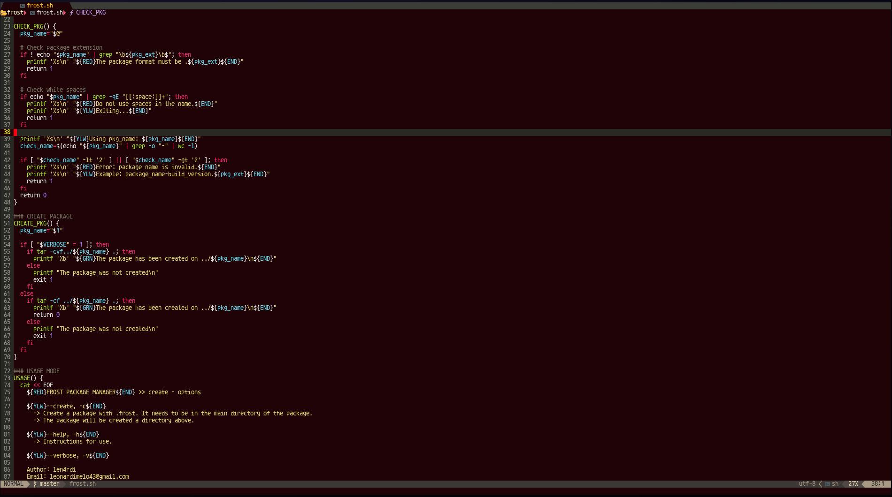
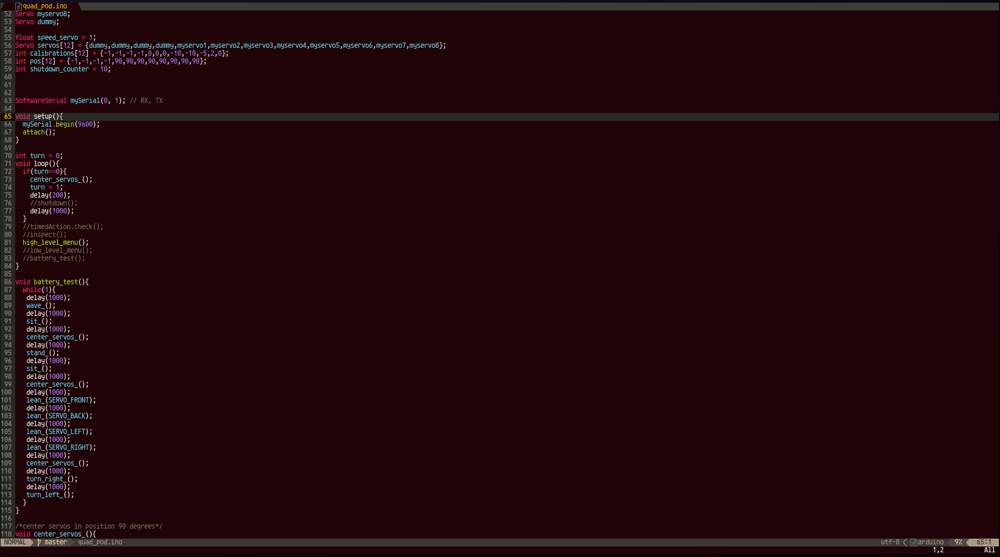
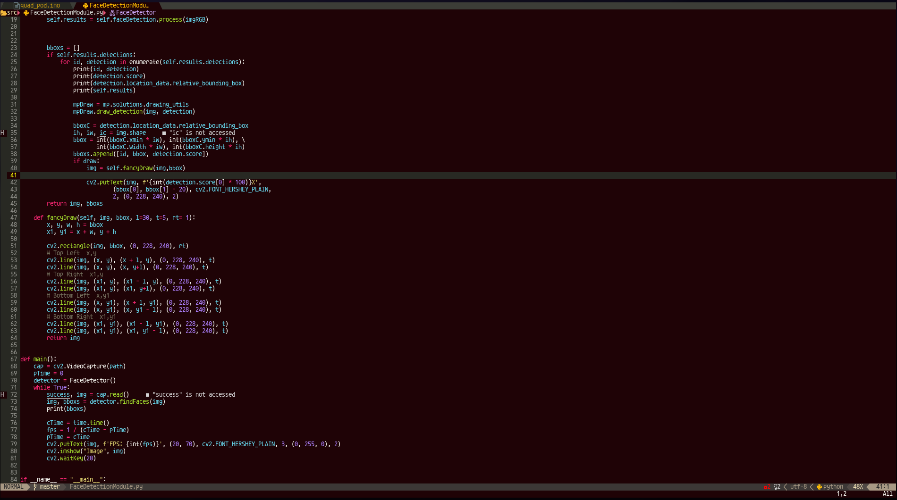
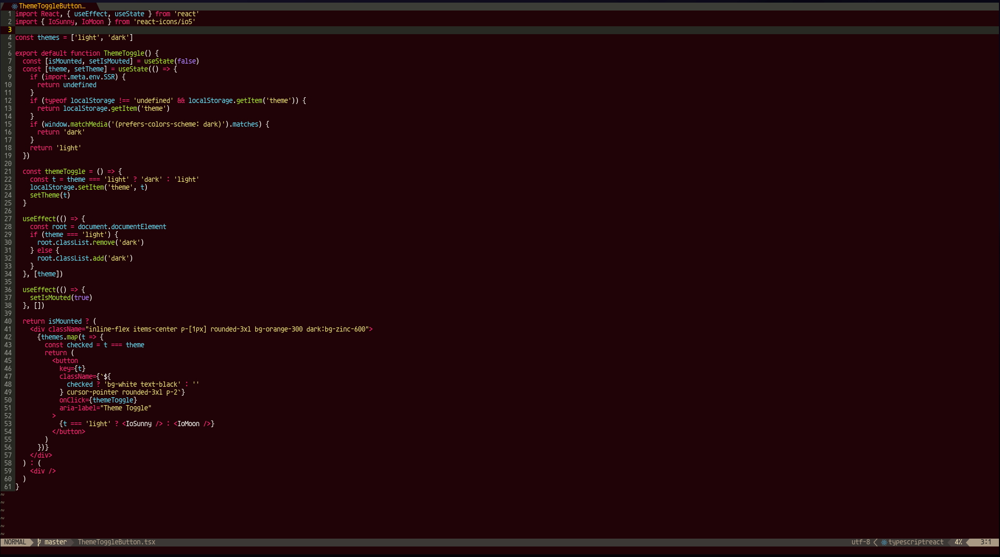

<div align="center">
  <h3 align="center">Dark Brown Monokai &#x1F308;</h3>
  <p align="center">
    <br />
    <a href="https://github.com/len4rdi/frost-pkg/issues">Report Bug &#128514;</a>
    <a href="https://github.com/len4rdi/frost-pkg/issues">Request Feature &#x1F6E0;</a>
  </p>
</div>

<!-- ABOUT THE PROJECT -->
## About The Project :heart:
Midnight monokai is a beatiful theme based on default `sublime text3 monokai`<br><br>
Supported on:<br>
&#x2705; NEOVIM<br>
&#x2705; VIM

<!-- GETTING STARTED -->
<div id="getting-started">

## Getting Started 🚀

Using Packer nvim
```sh
use 'len4rdi/dark-brown-monokai'
```
Using Plug
```sh
Plug 'len4rdi/dark-brown-monokai'
```
## Usage

```sh
:color dark-brown
```
or
```sh
:colorscheme dark-brown
```

## Examples 💡

Example for Bash language


Example C++ variant for arduino



Example for Python &#x1F40D;



Example Javascript-react and Typescript-react



Example for Lua language 🌕


My neovim settings: https://github.com/len4rdi/nvim-rc
